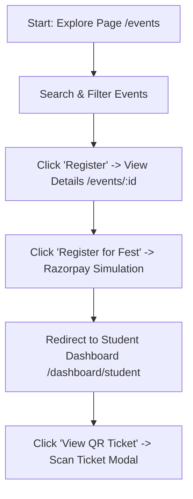
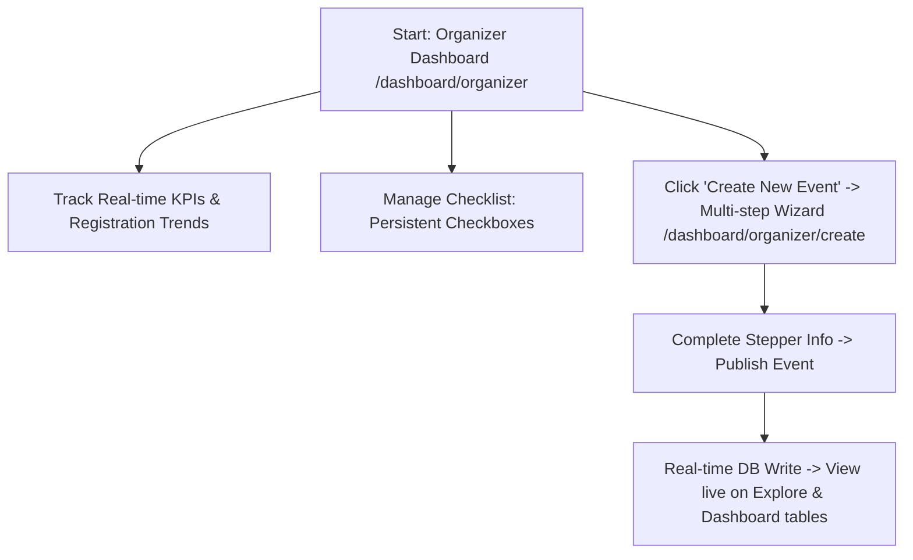
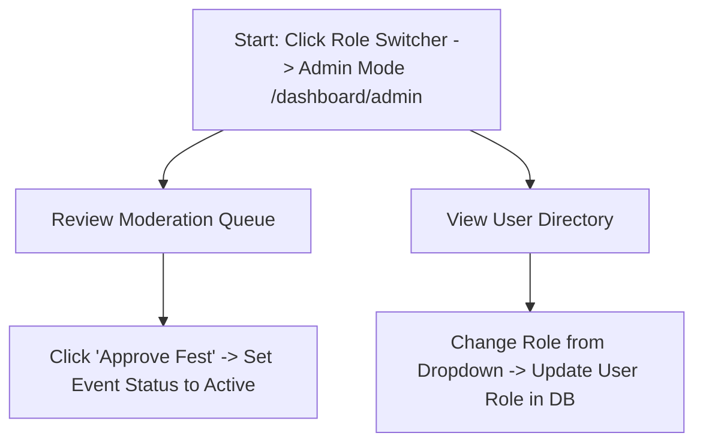
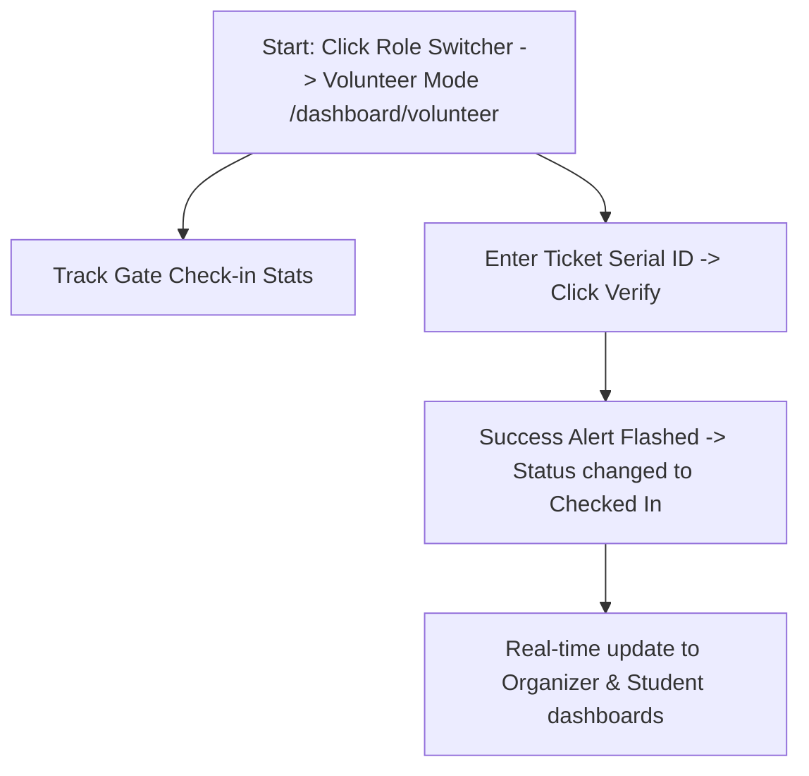

# FestFlow Prototype Workflow Guide

This document explains the workflow for both **Students** and **Organizers** to test the prototype end-to-end.

---

## 👨‍🎓 1. Student Workflow (Registration & Ticketing)

This flow demonstrates event discovery, payment mock (Razorpay), and ticket QR generation.

### Steps to Test:
1. **Browse Events**: Navigate to `http://localhost:3000/events`. Search for "Hack" or select "Tech" to filter events.
2. **Select Fest**: Click on the **Euphoria 2026** or **Hack-A-Nation 2026** card to view description, price, venue, and date details.
3. **Register (Razorpay Simulation)**: Click the **Register for Fest** button. The button status will change to "Paying with Razorpay..." for 2 seconds (simulating gateway transaction) and write the ticket to the database.
4. **View QR Code**: Click **Go to Dashboard** to be redirected to the Student Dashboard (`/dashboard/student`). Locate the newly registered event and click **View QR Ticket**. A modal will open displaying a fully scanned-ready SVG QR Code with your unique ticket serial.
5. **Download Certificates**: Under "Certificates & Awards", click the download icon next to past events to test simulated certificate PDF downloads.

---

## 👩‍💼 2. Organizer Workflow (Event Creation & Tracking)

This flow demonstrates analytics tracking, task management, and multi-step event publishing.

### Steps to Test:
1. **View Live Analytics**: Navigate to `http://localhost:3000/dashboard/organizer`. Review dynamic metrics cards (Total Events, Total Registrations, Gross Revenue) and the SVG Line Trend Chart.
2. **Toggle Persistent Tasks**: Tick/untick items under "Upcoming Tasks". The completed statuses are saved to the database in real-time, persisting even when you reload the page.
3. **Create Event Wizard**: Click the **Create New Event** button to launch the wizard (`/dashboard/organizer/create`).
   * **Step 1 (Basic Info)**: Enter event name (e.g., "RoboClash 2026"), select category, write description, and mock upload a poster. Click **Next Step**.
   * **Step 2 (Venues)**: Set venue location (e.g., "Mechanical Labs"), date, and time. Click **Next Step**.
   * **Step 3 (Tickets)**: Set ticket price (e.g., "150") and total capacity (e.g., "250"). Click **Next Step**.
   * **Step 4 (Review)**: Review the structured event details. Click **Publish Event**.
4. **Database Sync**: The wizard will write the event to `db.json`. You will be redirected back to the dashboard, where the new event will now show up inside the **Managed Events** table with live capacity tracking.
5. **Explore Live**: Go to `http://localhost:3000/events` to verify that your newly created event is live and searchable for students.

---

## 👑 3. Admin Workflow (Moderation & Access Control)

This flow demonstrates platform governance and event moderation.

### Steps to Test:
1. **Access Admin Panel**: Click the **Switch Mode** widget in the bottom-right corner and select **Admin Mode**. You will be routed to the Admin Dashboard (`/dashboard/admin`).
2. **Moderate Fest Submissions**: Under "Event Moderation Queue", locate the pending event (e.g., **Zenith Art & Lit Fest**). Click **Approve Fest**.
3. **Verify Activation**: Switch to **Student Mode** and go to `http://localhost:3000/events`. Verify that the approved event is now visible and registration is open.
4. **Manage User Roles**: In the Admin User Directory, locate "Lily Evans" (currently a Student). Change her role to **Organizer** using the dropdown. The action immediately updates her permissions in the database.

---

## 🙋 4. Volunteer Workflow (Attendee Check-In Gateway)

This flow demonstrates physical event check-in scanning.

### Steps to Test:
1. **Copy Ticket ID**: Switch to **Student Mode** and open your active ticket (e.g., **TICKET-TECH-7729-XX**). Copy the Ticket Verification ID.
2. **Access Gate Scanner**: Click the Switcher and select **Volunteer Mode**. You will be routed to `/dashboard/volunteer`.
3. **Check In Attendee**: Paste or type the Ticket ID into the input field and click **Verify & Check In**.
4. **Instant Verification**: A green confirmation alert will flash showing check-in success along with the student's name (Alex Mercer) and event name. The metrics cards (Checked In / Pending) will update instantly.
5. **Check Attendance Live**: Switch to **Organizer Mode** and verify that the checked-in attendance ratios have synchronized.
